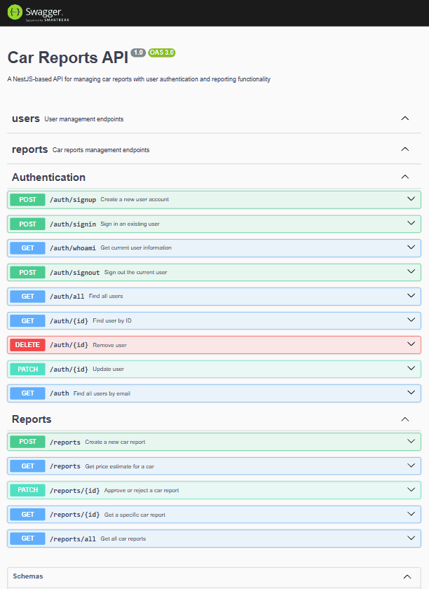

# 🚗 Car Reports API

<p id="description-car-reports-api"> A robust NestJS-based API for managing car reports with intelligent price estimation, user authentication, and comprehensive reporting functionality.</p>

## Example



<hr>

[](https://nestjs.com/)
[](https://www.typescriptlang.org/)
[](https://www.sqlite.org/)
[](/LICENSE)

## 📋 Table of Contents

- [Features](#-features)
- [Quick Start](#-quick-start)
- [API Documentation](#-api-documentation)
- [Price Estimation Algorithm](#-price-estimation-algorithm)
- [Project Structure](#-project-structure)
- [Development](#-development)
- [Testing](#-testing)
- [Database Management](#-database-management)
- [Environment Variables](#-environment-variables)
- [Technologies](#-technologies)
- [Contributing](#-contributing)
- [Troubleshooting](#-troubleshooting)
- [License](#-license)

## ✨ Features

### 🔐 Authentication & Authorization

- **Session-based authentication** with secure cookie management
- **Role-based access control** (Admin vs Regular users)
- **User management** (CRUD operations with admin privileges)

### 📊 Car Reports Management

- **Create, read, and approve/disapprove** car reports
- **Geographic filtering** with longitude/latitude coordinates
- **Comprehensive validation** with class-validator
- **Report approval workflow** (Admin-only feature)

### 🧠 Intelligent Price Estimation

- **Statistical algorithm** that finds the 3 most similar approved reports
- **Multi-factor matching**: make, model, location, year, and mileage
- **Geographic proximity** filtering (±5 degrees)
- **Year range** matching (±3 years)
- **Mileage-based** similarity scoring

### 📚 Developer Experience

- **Rich Swagger documentation** with interactive API explorer
- **Comprehensive testing suite** (Unit + E2E tests)
- **Code coverage reporting**
- **Database seeding** with sample data
- **VS Code REST Client** support (.http files)

## 🚀 Quick Start

### Prerequisites

- **Node.js** (v18 or higher)
- **npm** or **yarn**

### Installation

```bash
# Clone the repository
git clone https://github.com/IvanDerlich/car-reports.git
cd car-reports

# Install dependencies
npm install

# Create environment variables file
touch .env

# Add your custom cookie value to the .env file
echo "COOKIE_KEY=your-secret-test-cookie-key-here" > .env

# Add your custom database value to the .env file
echo "DB_NAME=db.your-local-database-name.sqlite" >> .env

# Run Migrations
npm run migrations:run

# Seed the database with sample data
npm run db:seed

# Start the development server
npm run dev
```

🎉 **Success!** Your API is now running at `http://localhost:3000`

Now you should be seeing something like this:


## 📖 API Documentation

Once the service is running locally visit the **Swagger UI** at:

http://localhost:3000/api


### 🧪 Testing Scenarios

Here are some recommended workflows to explore the API functionality:

#### User Management & Authentication

- **Create an admin user** and test role-based permissions
- **Login/logout** to verify session management
- **Use the whoAmI endpoint** to check your current authentication status
- **Create regular users** and test different permission levels

#### Report Management

- **Create car reports** with various vehicle data
- **Approve/reject reports** (admin-only functionality)
- **View all reports** and test filtering capabilities
- **Get price estimates** using the preset values in Swagger (database is pre-seeded for testing)

#### Price Estimation Algorithm Testing

- **Test price changes**: Add reports within the algorithm's range and observe how the average price updates
- **Verify filtering**: Add reports outside the geographic/year range or unapproved reports to confirm they don't affect estimates
- **Test mileage limits**: Add reports with excessive mileage differences when 3 matches already exist to verify they're ignored
- **Test closer matches**: Add reports with better mileage proximity to see how they change the average

#### Authorization Testing

Verify that non-admin users **cannot**:

- View all users
- Search for users by ID or email
- Delete any user
- Update user information
- Approve or reject reports

### Testing with REST Client

Use the included `.http` files for easy API testing with you IDE and the proper plugin:

- **User endpoints**: `src/users/request.http`
- **Report endpoints**: `src/reports/requests.http`

## 🧮 Price Estimation Algorithm

The price estimation feature uses a statistical approach:

### Algorithm Steps

1. **🔍 Find Similar Cars**
   - Same make and model
   - Geographic proximity (±5° longitude/latitude)
   - Similar year (±3 years)
   - Closest mileage

2. **📊 Calculate Average**
   - Returns average price of 3 most similar **approved** reports
   - Ignores unapproved reports for accuracy

3. **📝 Input Requirements**
   - Car make and model
   - Year (1930 to current year)
   - Geographic coordinates (longitude/latitude)
   - Mileage (0 to 1,000,000)

## 🏗️ Project Structure

```
├── src/                      # Source code
│   ├── users/               # User management module
│   │   ├── dtos/            # Data Transfer Objects
│   │   ├── user.entity.ts   # User entity definition
│   │   ├── users.controller.ts # User endpoints
│   │   ├── users.service.ts # User business logic
│   │   └── users.controller.docs.ts # API documentation
│   ├── reports/             # Reports management module
│   │   ├── dtos/            # Report DTOs
│   │   ├── report.entity.ts # Report entity
│   │   ├── reports.controller.ts # Report endpoints
│   │   ├── reports.service.ts # Report business logic
│   │   └── reports.controller.docs.ts # API documentation
│   ├── guards/              # Authentication guards
│   ├── interceptors/        # Response serialization
│   ├── validators/          # Custom validation rules
│   ├── config/              # Configuration files
│   ├── types/               # TypeScript type definitions
│   └── main.ts              # Application entry point
├── test/                    # End-to-end tests
│   ├── fixtures/            # Test data and fixtures
│   ├── app.e2e-spec.ts      # Main E2E test suite
│   ├── auth.e2e-spec.ts     # Authentication E2E tests
│   ├── reports.e2e-spec.ts  # Reports E2E tests
│   ├── setup.ts             # Test setup configuration
│   └── jest-e2e.json        # Jest E2E configuration
├── dev/                     # Development tools and scripts
│   ├── db/                  # Database development files
│   └── scripts/             # Development scripts
├── docs/                    # Documentation images
├── coverage/                # Test coverage reports
└── dist/                    # Built application (generated)
```

## 🛠️ Development

### Available Scripts

```bash
# Development
npm run dev              # Start with hot reload

# Building
npm run build            # Build for production

# Code Quality
npm run format           # Format code with Prettier
npm run format:check     # Check code formatting

# Database
npm run db:clear         # Clear database
npm run db:seed          # Seed with sample data
npm run db:reset         # Clear + seed database
npm run migrations:run   # Run database migrations
```

## 🧪 Testing

### Environment Setup

Create a `.env.test` file at the root with the following variables:

```env
COOKIE_KEY=your-secret-cookie-key-here
DB_NAME=db.your-database-name.sqlite
NODE_ENV=development
```

### Running Tests

```bash
# Unit tests
npm run test

# E2E tests
npm run test:e2e

# Test coverage for both unit and e2e tests
npm run test:cov

# Watch mode
npm run test:watch
```

### Test Structure

- **Unit Tests**: Test individual components and services
- **E2E Tests**: Test complete API workflows
- **Coverage Reports**: Available in `coverage/` directory

## 🗄️ Database Management

### SQLite Database

The application uses SQLite with TypeORM for data persistence.

### Database Scripts

```bash
# Clear all data
npm run db:clear

# Add sample data
npm run db:seed

# Reset database (clear + seed)
npm run db:reset
```

### Database Inspection

```bash
# Install SQLite CLI
sudo apt update && sudo apt install sqlite3

# Access database
sqlite3 your-database-name.sqlite

# View tables
.tables

# Query data
SELECT * FROM user;
SELECT * FROM report;
SELECT * FROM migrations;
```

## ⚙️ Environment Variables

These variables should be present in both the .env file for local usage and the .env.test file for testing

| Variable     | Description                       | Required | Default       |
| ------------ | --------------------------------- | -------- | ------------- |
| `COOKIE_KEY` | Secret key for session encryption | ✅       | -             |
| `DB_NAME`    | SQLite database file path         | ✅       | -             |
| `NODE_ENV`   | Environment mode                  | ❌       | `development` |

## 🛠️ Technologies

<ul id="tech-list-car-reports-api">
   <li>NestJS</li>
   <li>TypeScript</li>
   <li>TypeORM</li>
   <li>SQLite</li>
   <li>Jest</li>
   <li>Swagger</li>
   <li>Prettier</li>
   <li>ESLint</li>
   <li>Argon2</li>
   <li>class-validator</li>
   <li>cookie-session</li>
</ul>

## 🤝 Contributing

Contributions are welcomed! Please follow these steps:

1. **Fork** the repository
2. **Create** a feature branch (`git checkout -b feature/amazing-feature`)
3. **Commit** your changes (`git commit -m 'Add amazing feature'`)
4. **Push** to the branch (`git push origin feature/amazing-feature`)
5. **Open** a Pull Request

### Development Guidelines

- Write tests for new functionality
- Ensure all tests pass (`npm test`)
- Follow the existing code style
- Update documentation as needed

## 🔧 Troubleshooting common Issues

#### Database Connection Issues

```bash
# Ensure database file exists
ls -la *.sqlite

# Check permissions
chmod 644 your-database.sqlite
```

#### Environment Variables Not Loading

```bash
# Check .env file exists
ls -la .env

# Verify file format (no spaces around =)
cat .env
```

#### Migration Issues

```bash
# Reset migrations
npm run db:reset
npm run migrations:run
```

### Getting Help

- 📧 **Email**: [a@ivanderlich.com](mailto:a@ivanderlich.com)
- 🐛 **Issues**: [GitHub Issues](https://github.com/IvanDerlich/car-reports/issues)
- 📖 **Documentation**: [Swagger UI ](http://localhost:3000/api): You can access this only if the server is running locally

## 🚀 Future Improvements

- [ ] **Server-side sessions** for better security
- [ ] **JWT authentication** as alternative to cookies
- [ ] **Rate limiting** and API throttling
- [ ] **OpenAPI export** for Postman/Insomnia
- [ ] **Docker containerization**
- [ ] **CI/CD pipeline** setup
- [ ] **Performance monitoring** and logging
- [ ] **Caching layer** (Redis)
- [ ] **Email notifications** for report status changes

## 📄 License

This project is licensed under the **MIT License** - see the [LICENSE](LICENSE) file for details.

## 👨‍💻 Author

**Ivan Derlich**

- 🌐 Website: [ivanderlich.com](https://ivanderlich.com)
- 📧 Email: [a@ivanderlich.com](mailto:a@ivanderlich.com)
- 💼 LinkedIn: [Ivan Derlich](https://linkedin.com/in/ivanderlich)

---

<div align="center">

**⭐ If you found this project helpful, please give it a star!**

Made for you with ❤️ by [Ivan Derlich](https://ivanderlich.com)

</div>
